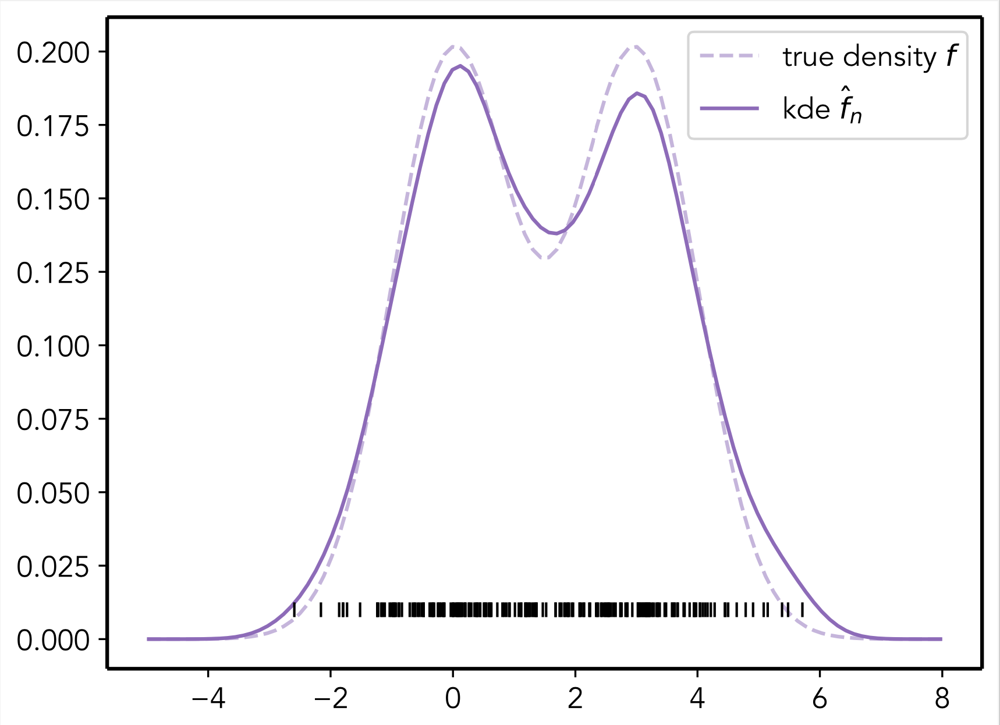

# mystatlearn

`mystatlearn` is a Python package for statistical learning. It accompanies my journey with statistical learning, non-parametric statistics and high-dimensional methods. The majority of the content is inspired by the classic textbook *The Elements of Statistical Learning* [1]. Remaining ideas stem from the Modern Statistical Methods and Topics in Statistical Theory courses taught by R. Shah and R. Samworth at the University of Cambridge (Fall 2022). The main goal of the package is for educational purposes. It contains examples of algorithms for regression, classification, smoothing, filtering, etc. with a focus on readable and accessible implementations in the style of `scikit-learn`.

In addition, the repository also contains a range of Jupyter notebooks showcasing simple applications of the algorithms implemented in `mystatlearn` accompanied by interactive Plotly visualisations. 

## Contents

- **Classification**
  - LDA and QDA
  - Kernel SVM

- **Regression**
  - OLS
  - Ridge Regression
  - Kernel Ridge Regression
  - Non-parametric regression
    - B-spline regression
    - Cubic spline regression
    - Local polynomial regression

- **Interpolation**
  - B-splines
  - cubic splines
  
- **Smoothing**
  - Kernel density estimation

--------
[1] - The Elements of Statistical Learning, Trevor Hastie, Robert Tibshirani, Jerome Friedman, https://doi.org/10.1007/978-0-387-84858-7.
